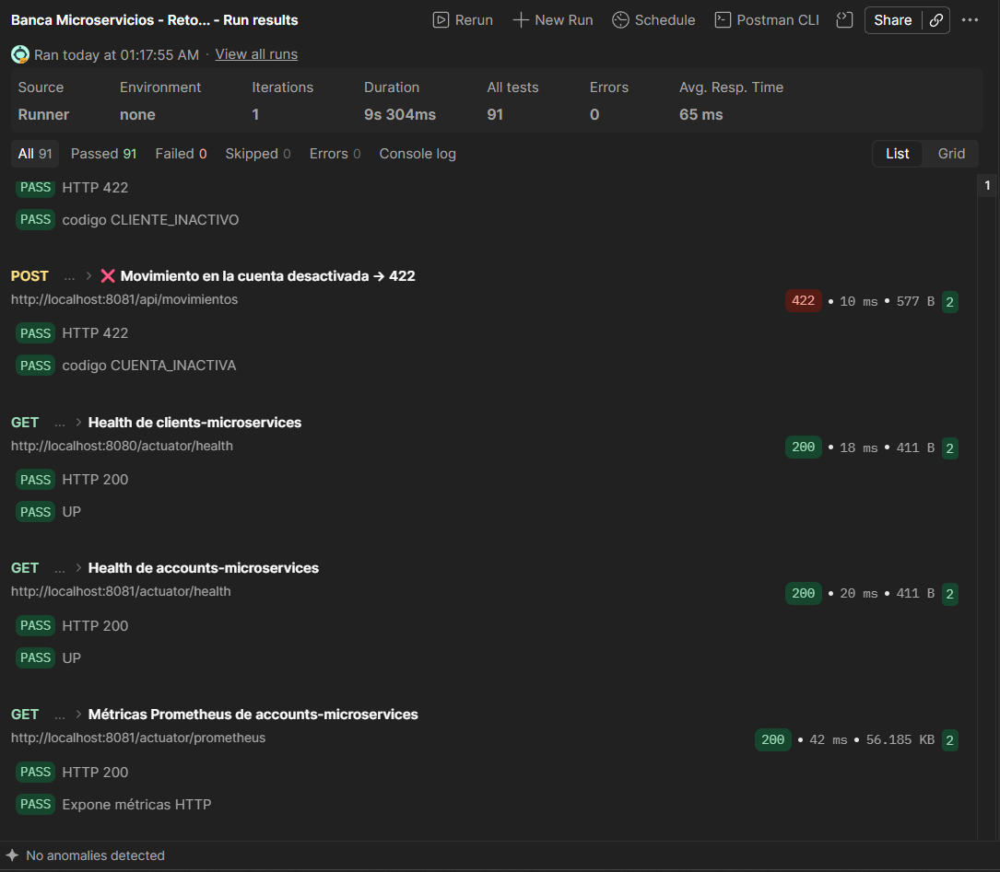
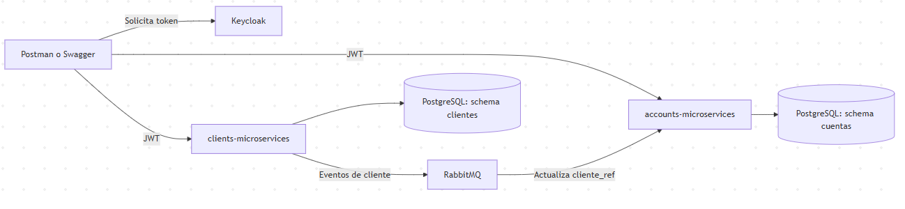

# Reto técnico Java Spring Boot

[](https://github.com/JuanPabloPinza/banking-springboot-microservices/actions/workflows/ci.yml)

Implementación del reto técnico de TCS para el perfil semi-senior. Permite administrar clientes, cuentas y movimientos, y consultar estados de cuenta por fechas.

El proyecto está dividido en dos microservicios que se comunican mediante RabbitMQ. Se ejecuta con Docker Compose e incluye una colección de Postman con los casos del enunciado.

Autor: Juan Pablo Pinza Armijos.

## Contenido

- [Ejecutar el proyecto](#ejecutar-el-proyecto)
- [Probar con Postman](#probar-con-postman)
- [Requisitos implementados](#requisitos-implementados)
- [Arquitectura](#arquitectura)
- [Pruebas](#pruebas)
- [Decisiones y limitaciones](#decisiones-y-limitaciones)

## Ejecutar el proyecto

Necesitas Docker con Docker Compose. La compilación se hace dentro de los contenedores, por lo que no hace falta instalar Java ni Maven para levantar la solución.

```bash
git clone https://github.com/JuanPabloPinza/banking-springboot-microservices.git
cd banking-springboot-microservices
docker compose up --build -d
docker compose ps
```

Espera a que los cinco servicios aparezcan como `healthy`. La primera ejecución descarga dependencias e imágenes y puede tardar varios minutos. Si alguno no arranca, revisa `docker compose logs clients-microservices accounts-microservices`.

| Servicio | Dirección |
|---|---|
| API de clientes | http://localhost:8080/api/clientes |
| API de cuentas | http://localhost:8081/api/cuentas |
| Swagger de clientes | http://localhost:8080/swagger-ui.html |
| Swagger de cuentas y movimientos | http://localhost:8081/swagger-ui.html |
| Keycloak | http://localhost:8180 |
| Consola de RabbitMQ | http://localhost:15672 |
| PostgreSQL | `localhost:5434`, base `banca` |

Los puertos de la tabla y el puerto `5672` de RabbitMQ deben estar disponibles. Las credenciales locales son `admin / admin` para Keycloak y `banca / banca` para RabbitMQ. Son datos de demostración.

[BaseDatos.sql](BaseDatos.sql) crea los esquemas, usuarios, tablas e índices cuando se inicializa el volumen de PostgreSQL. Si ese volumen ya existe, el script no se ejecuta de nuevo. Para detener los servicios y conservar los datos, usa `docker compose stop`.

### Acceso a la API

Las rutas `/api/**` requieren un token de Keycloak. Postman lo obtiene automáticamente. Para usar Swagger, solicita un token y pega el valor de `access_token` en **Authorize**:

```bash
curl --request POST "http://localhost:8180/realms/banca/protocol/openid-connect/token" --data "grant_type=client_credentials&client_id=banca-postman&client_secret=banca-postman-secret"
```

En Windows PowerShell puedes usar `curl.exe` con los mismos argumentos. Swagger y los endpoints de salud son públicos.

## Probar con Postman

1. Importa la [colección de Postman](postman/banking-microservices.postman_collection.json).
2. Comprueba que los servicios estén listos y que la base no tenga datos de una ejecución anterior de la colección.
3. Abre el Runner y ejecuta la colección completa, en el orden de sus carpetas.

La colección contiene 46 peticiones y 91 comprobaciones. Obtiene el token, guarda los identificadores generados y calcula las fechas del reporte. No necesita un archivo de entorno adicional.

Los casos crean a Jose Lema, Marianela Montalvo y Juan Osorio, registran sus cuentas y movimientos, y consultan el reporte de Marianela. También comprueban saldo insuficiente, duplicados, corrección y eliminación del último movimiento, reintentos con la misma clave y desactivación de cuentas.

La comunicación entre servicios es asíncrona. La colección incluye pausas antes de comprobar los cambios recibidos por eventos. Si el equipo está bajo carga, puede ser necesario aumentar esas pausas.

Para repetirla necesitas una base vacía, porque las identificaciones y los números de cuenta son únicos. El [documento técnico](docs/decisiones.md#entorno-local) explica cómo reiniciar el entorno y qué datos se eliminan.

<details>
<summary>Resultado del Runner: 91 comprobaciones aprobadas, sin fallos</summary>



</details>

## Requisitos implementados

| Requisito | Implementación |
|---|---|
| Dos microservicios y comunicación asíncrona | `clients-microservices` y `accounts-microservices`, conectados mediante RabbitMQ |
| F1: CRUD de clientes, cuentas y movimientos | `/api/clientes`, `/api/cuentas` y `/api/movimientos` |
| F2: movimientos y actualización del saldo | Valores positivos para depósitos y negativos para retiros |
| F3: saldo insuficiente | HTTP 422 con el mensaje exacto "Saldo no disponible" |
| F4: estado de cuenta por cliente y fechas | `GET /api/reportes?cliente={clienteId}&fecha=yyyy-MM-dd,yyyy-MM-dd` |
| F5: prueba de la entidad Cliente | `ClienteTest` |
| F6: integración, deseable para semi-senior | `ClienteIT`, `MovimientoIT` e `IntercalacionesIT` con Testcontainers |
| Pruebas de endpoints | `ClienteControllerTest`, `MovimientoControllerTest` y `ReporteControllerTest` |
| Docker, indicado también en F7 | [docker-compose.yml](docker-compose.yml) y un Dockerfile por servicio |
| Script SQL y colección de validación | [BaseDatos.sql](BaseDatos.sql) y [Postman](postman/banking-microservices.postman_collection.json) |

Clientes y cuentas admiten PUT y PATCH. Los movimientos se corrigen con PUT. El término "Push" del enunciado se interpretó como PATCH para la actualización parcial.

### Comportamiento de la API

Clientes y cuentas usan borrado lógico. La baja de un cliente se propaga por eventos y desactiva sus cuentas. Una cuenta solo puede reactivarse si su cliente está activo.

Solo se puede corregir o eliminar el último movimiento de una cuenta. En ambos casos se recalcula el saldo. Los montos usan `BigDecimal` con dos decimales, sin redondeo silencioso.

Los errores se devuelven en el formato estándar `ProblemDetail` (RFC 9457), con un `codigo` estable. El saldo insuficiente y las operaciones sobre cuentas o clientes inactivos responden 422; los duplicados y conflictos, 409.

El registro de movimientos acepta la cabecera opcional `Idempotency-Key`. Repetir la misma solicitud devuelve el movimiento existente sin aplicar otra vez el importe. Si el movimiento fue corregido, devuelve su estado actual. Si fue eliminado o la clave se usa con otra solicitud, responde 409.

El reporte recibe ambas fechas inclusive, con un máximo de 366 días. Agrupa cliente, cuentas y movimientos, e incluye cuentas sin movimientos que ya estuvieran abiertas al final del rango. Distingue el saldo de apertura, el saldo actual y los saldos del período. Los [campos y criterios del reporte](docs/decisiones.md#reporte-de-estado-de-cuenta) están en la documentación técnica.

## Arquitectura



Ambos esquemas están en la misma instancia de PostgreSQL, con un usuario por servicio. Accounts mantiene una copia local de los datos del cliente que necesita y no hace llamadas HTTP a clients.

Cada servicio sigue una arquitectura hexagonal (puertos y adaptadores): separa el dominio, los casos de uso y los adaptadores de infraestructura, y el dominio no depende de Spring ni de JPA. Las entidades JPA y los DTO de la API se mantienen fuera del modelo de dominio. Se aplican los patrones Repository, DTO con mappers de MapStruct, Command para las entradas de los casos de uso y Value Object para la identificación del cliente.

Las tecnologías principales son Java 21, Spring Boot 4.1.1, PostgreSQL 17, RabbitMQ 4.3 y Keycloak 26.7. Las versiones y dependencias están en los `pom.xml` y en Docker Compose.

## Pruebas

Para ejecutarlas fuera de Docker necesitas un JDK 21. El repositorio incluye Maven Wrapper. Ejecuta estos comandos desde el directorio de cada microservicio:

| Comando | Qué ejecuta |
|---|---|
| `./mvnw test` | Pruebas unitarias y de endpoints, sin Docker |
| `./mvnw verify` | Las anteriores, integración con Testcontainers y comprobación de cobertura. Requiere Docker activo |
| `./mvnw org.pitest:pitest-maven:mutationCoverage` | Pruebas de mutación, después de compilar y ejecutar las pruebas |

En Windows PowerShell sustituye `./mvnw` por `.\mvnw.cmd`. Por ejemplo:

```powershell
cd accounts-microservices
.\mvnw.cmd verify
```

Las pruebas de integración usan PostgreSQL y RabbitMQ en contenedores propios. Cubren los casos de negocio y operaciones simultáneas sobre saldos, cuentas y claves de idempotencia. `IntercalacionesIT` controla el momento en que se cruzan las transacciones para comprobar esos escenarios.

El mínimo configurado es 80 % de cobertura de líneas y 70 % de mutantes detectados en dominio y aplicación. Los reportes se generan en `target/site/jacoco/index.html` y `target/pit-reports/index.html` de cada servicio.

El [workflow de GitHub Actions](.github/workflows/ci.yml) ejecuta las pruebas, comprueba esos mínimos y construye las imágenes. En los pushes a `main`, si los pasos anteriores pasan, publica las imágenes de ambos servicios en GHCR.

## Decisiones y limitaciones

Las [decisiones técnicas](docs/decisiones.md) resumen el manejo de saldos, reintentos y reportes, junto con los límites de esta implementación.

Los dos pendientes principales para producción son:

- Guardar los eventos con un patrón Outbox para poder reintentar su publicación si RabbitMQ falla después del commit.
- Añadir autorización por rol y por propietario de cuenta. Actualmente la API valida el token.

Las credenciales incluidas y la configuración de Keycloak están destinadas a ejecutar y evaluar el reto en local.
